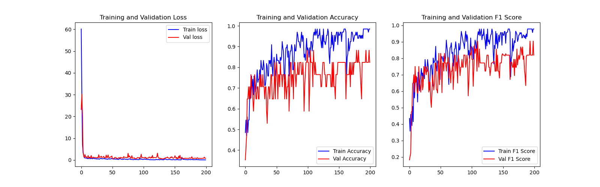

# Alzheimer's disease classification

## Dataset

ADNI：https://adni.loni.usc.edu/

老年痴呆症(AD)、轻度认知障碍(MCI)和老年人对照患者(CN): https://blog.csdn.net/weixin_43444314/article/details/90644839

## Training process

## Test result

| testa_id | AD       | CN       |
| -------- | -------- | -------- |
| testa_1  | 44.6033% | 55.3967% |
| testa_2  | 0%       | 100%     |
| testa_3  | 98.33%   | 1.67%    |
| testa_4  | 100.00%  | 0.00%    |
| testa_5  | 0.00%    | 100.00%  |
| testa_6  | 0.00%    | 100.00%  |
| testa_7  | 99.21%   | 0.79%    |

